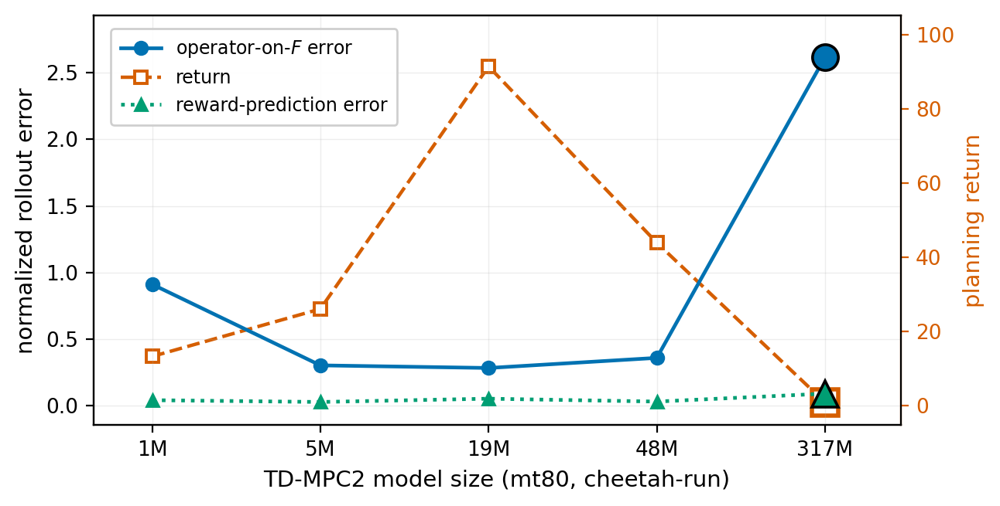

# Operator-on-F

**A planning-time diagnostic for latent world models.** Operator-on-F compares a
model's *k*-step latent pushforward to the environment's, read out on a set of
observable functionals *F*, and flags planning-relevant failures that reward-
and value-equivalence checks can miss. Operator-on-*F* **complements**
value-equivalence — it does not replace it. The recommendation is to report
both, not to pick a winner.

<p align="center">
  
</p>

<p align="center"><sub><em>On a released TD-MPC2 size sweep (cheetah-run):
Operator-on-*F* tracks the return loss where reward and Bellman-residual checks
do not. N.b. the two vertical axes are on different scales (error left, return
right), so read the shapes, not the crossing height.</em></sub></p>

Code and data to reproduce the results in:

> **Operator-on-F complements value-equivalence: a planning-time diagnostic for
> latent world models.** Donna Vakalis. RLC 2026 World Model Workshop
> *(non-archival)*.
>
> 📄 **Paper:** _arXiv / OpenReview link coming soon._

## The thirty-second version

You have a learned world model. You roll it forward *k* steps in its own latent
space and ask: did the rollout land where the real environment did? The usual
grade checks one thing, the reward (and value) the model predicts. This paper
adds a second grader, operator-on-*F*, that checks where the rollout lands on a
small set of *observables*, not just the reward. On one released model sweep,
the two graders disagree, and the second one is the one that tracks how well
planning actually works.

## What the diagnostic does

World-model evaluation often asks only whether a model predicts reward and value
well. **Operator-on-F** instead compares a model's *k*-step latent pushforward to
the environment's, read out on a chosen set of observable functionals *F*.

For an anchor `(s_t, a_{t:t+k-1}, s_{t+k})` the model produces a predicted latent
`ẑ = O_k(enc(s_t), a)` and the environment provides the encoded true next state
`z' = enc(s_{t+k})`. For each functional `φ ∈ F` the per-anchor error is

```
e_φ = |φ(ẑ) − φ(z')| / σ_φ           σ_φ = std of φ(z') across anchors
```

aggregated by RMS over `(φ, anchor)`. Two aggregations are reported: the **value
slice** (`F = {reward, value}`, what value-equivalence checks see) and the **full
F** (value slice + a held-out PCA basis on the encoded next-state geometry, the
planning-relevant signal a reward/value-only check can miss).

## Headline results (cheetah-run)

On a released TD-MPC2 `mt80` size sweep (5 sizes), operator-on-F tracks the
executed-return loss while reward-prediction error and the Bellman residual do
not:

| across-size Spearman vs. return | value |
|---|---|
| operator-on-F | **−0.90** |
| reward-prediction error | −0.30 |
| Bellman residual | −0.10 |

At 317M the operator error is an order of magnitude above the 0.28–0.36 cluster
while reward error stays flat — see [`figures/scissors.pdf`](figures/scissors.pdf).
A cross-architecture check (pure-SSL LeWM vs. single-task TD-MPC2) gives the same
operator/reward resolution gap.

## Layout

```
operator_on_F/       reference implementation of the diagnostic + statistics
  diagnostic.py        operator-on-F error, held-out PCA basis, comparators
  stats.py             Spearman, leave-one-out, bootstrap
results/             the reported numbers (JSON), enough to verify every claim
  size_sweep.json      per-size operator / reward / return / Bellman + correlations
  cross_architecture.json
figures/             scripts that regenerate the paper figures from results/
  make_scissors.py, make_metric_disagreement.py, make_cross_architecture.py
reproduce.py         recomputes the paper's correlations from results/ and checks them
tests/               synthetic sanity tests for the diagnostic
```

## Reproduce

```bash
pip install numpy matplotlib          # only dependencies
python3 reproduce.py                  # checks results/ reproduce the paper's numbers
python3 figures/make_scissors.py      # regenerates figures/scissors.pdf   (+ the others)
python3 -m pytest tests               # or: PYTHONPATH=. python3 tests/test_diagnostic.py
```

`reproduce.py` recomputes the across-size Spearman correlations, the
leave-one-out stability values, and the cross-architecture ratio directly from
`results/` and asserts they match the values reported in the paper.

## Data

`results/` contains the final per-size and cross-architecture numbers, which is
all that is needed to verify the reported statistics and regenerate the figures.
The raw per-anchor latent dumps (used for the anchor-bootstrap confidence
intervals) are large and are **not** shipped; they are regenerated from the
publicly released TD-MPC2 checkpoints and a DeepMind Control `cheetah-run`
rollout collection.

## Citation

```bibtex
@inproceedings{vakalis2026operator,
  title     = {Operator-on-F complements value-equivalence: a planning-time
               diagnostic for latent world models},
  author    = {Vakalis, Donna},
  booktitle = {RLC 2026 World Model Workshop},
  year      = {2026}
}
```

## License

MIT — see [LICENSE](LICENSE).
